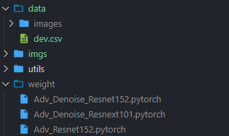

# Attack-ImageNet

No.2 solution of Tianchi ImageNet Adversarial Attack Challenge. 

We use a modified M-DI2-FGSM to attack the defense model.

## Requirement

The recommended environment is as follows:

Python 3.7.0, PyTorch 1.3.1, NumPy 1.15.1, OpenCV 3.4.1, Pandas 0.23.4

At least you should ensure python 3.6.0+ and pytorch 1.0+.

## Prepare

Download the defense models from [Google Drive](https://drive.google.com/open?id=1CRkjO82ptK_V-Y5mwsIqTGsT43tO5vgt) or [BaiduPan](https://pan.baidu.com/s/184_kG_-X-w8BRMUv5zWpPw) (hrtp).

The defense models are all from "Feature denoising for improving adversarial robustness"[1]. *Thanks to Dr. Huang for providing the pytorch version of the models.*

Place the official `images` folder and downloaded `weight` folder as follows:



**Note that we have modified the original `dev.csv` (the label has an offset of -1).**

## Run

You just need to run:

```
python simple_attack.py
```

optional arguments:

```
  --input_dir INPUT_DIR     path to data
  --output_dir OUTPUT_DIR   path to results
  --batch_size BATCH_SIZE   mini-batch size
  --steps STEPS             iteration steps
  --max_norm MAX_NORM       Linf limit
  --div_prob DIV_PROB       probability of diversity
```

**Note that more steps can achieve better performance.**

## Method

1. All source models are strong defense models.[1]
2. Use SGD with momentum, and normalize the gradient by Linf.[2]
3. Fuse the logits of 3 source models to build ensemble model.[2]
4. Add input diversity (resize and padding).[3]
5. Fuse the loss of targeted attack and untargeted attack.
6. Remove the sign() function of IFGSM, and use the gradient toward perturbations to update.

## Reference

[1] Xie, Cihang, et al. "Feature denoising for improving adversarial robustness." Proceedings of the IEEE Conference on Computer Vision and Pattern Recognition. 2019.

[2] Dong, Yinpeng, et al. "Boosting adversarial attacks with momentum." Proceedings of the IEEE conference on computer vision and pattern recognition. 2018.

[3] Xie, Cihang, et al. "Improving transferability of adversarial examples with input diversity." Proceedings of the IEEE Conference on Computer Vision and Pattern Recognition. 2019.