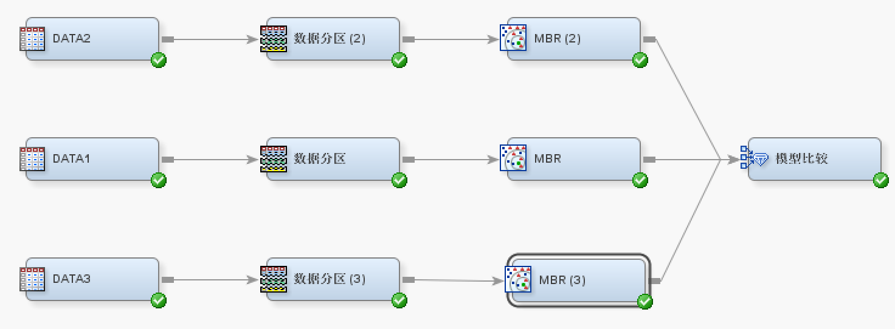
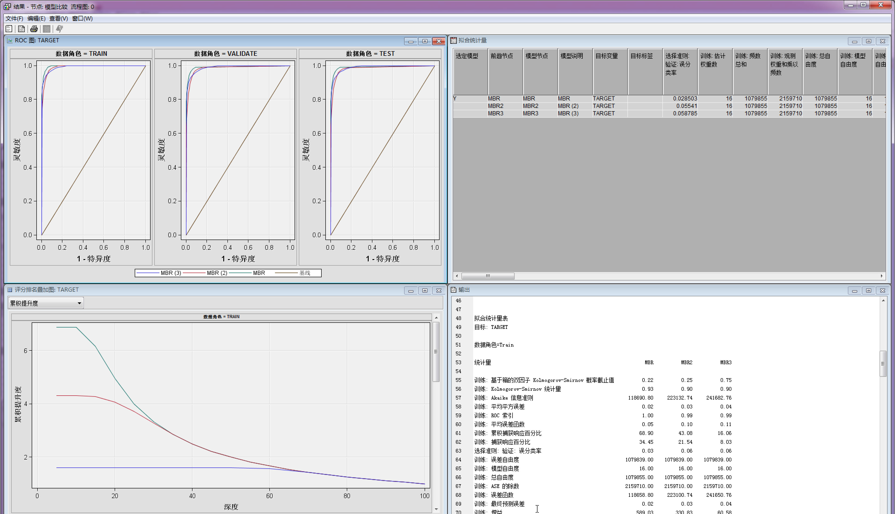

> SAS, STATISTICAL ANALYSIS SYSTEM.

根据个人习惯，以下采用叙事格式为：
``` shell
code
# output
```
修订如下：
> C000 ；

#### 〇、SAS介绍
语句简易，**DATA皆PROC**；

玩味一下，丰富天池代码；

**Score: 0.8525**

相关教程可咨：
> https://github.com/IvanaXu/DataSAS
> 

#### 一、方案明细
配置数据路径
``` SAS
	OPTIONS COMPRESS = YES;
	
/*	00.逻辑库 */
	LIBNAME ANA ".\data\hy_round1";
	%LET CP = .\code\Hy_round1;
	%LET DP = .\data\hy_round1\hy_round1_train_20200102\hy_round1_train_20200102;
	%LET TP = .\data\hy_round1\hy_round1_testA_20200102\hy_round1_testA_20200102;

	%LET PN = 000001;
```
csv数据读取，并打印日志
``` SAS
/*	01.数据读取 */
	PROC PRINTTO LOG = "&CP.\RUN.log" NEW;RUN;
	
		%MACRO R();
			PROC DELETE DATA = ANA.RESULT;RUN;
			DATA ANA.RESULT;
			FORMAT VAR1 VAR2 VAR3 VAR4 VAR5 VAR6 VAR7 $30.;
			STOP;
			RUN;

			%DO I = 0 %TO 6999;
				%PUT &I.;
				
				FILENAME INPT "&DP.\&I..csv" ENCODING = "UTF-8";
				PROC IMPORT 
					DATAFILE = INPT
					OUT = DEMO 
					DBMS = CSV 
					REPLACE;
					GETNAMES = NO;
				RUN;

				PROC APPEND DATA = DEMO BASE = ANA.RESULT;RUN;
				PROC DELETE DATA = DEMO;RUN;
			%END;
			
			DATA ANA.RESULT;
			SET ANA.RESULT;
			WHERE VAR7 ^= "type";
			RUN;
		%MEND;
		

		%MACRO T();
			PROC DELETE DATA = ANA.TEST;RUN;

			%DO I = 7000 %TO 8999;
				%PUT &I.;

				FILENAME INPT "&TP.\&I..csv" ENCODING = "UTF-8";
				PROC IMPORT
					DATAFILE = INPT
					OUT = DEMO
					DBMS = CSV
					REPLACE;
					GETNAMES = NO;
				RUN;

				DATA DEMO;
				SET DEMO(WHERE = (VAR6 ^= "time"));
				FORMAT
					ID $4.
					X_1 X_2 X_1V X_2V 24.12
					X_3 X_3_1 8.2 X_3_2 8.4
					X_4 X_4_1 8.2 X_4_2 8.4 X_3_4 8.2
					X_5_MON X_5_DAY X_5_HOR X_5_MIS X_5_SEC 8. X_5_DMY DATETIME20.
					X_5_DMYW 2.
				;
				ID = VAR1;
				X_1 = VAR2 + 0;
				X_2 = VAR3 + 0;
				X_1V = X_1/20037508.34*180;
				X_2V = 180/CONSTANT("PI")*(2*ATAN(EXP(X_2/20037508.34*180*CONSTANT("PI")/180))-CONSTANT("PI")/2);
				X_3 = VAR4 + 0;
				X_3_1 = X_3 > 0;
				X_3_2 = X_3/100;
				X_4 = VAR5 + 0;
				X_4_1 = X_4 > 0;
				X_4_2 = X_4/360;
				X_3_4 = X_3 > 0 OR X_4 > 0;
				X_5_MON = SUBSTR(COMPRESS(VAR6,"0123456789","K"),1,2)+0;
				X_5_DAY = SUBSTR(COMPRESS(VAR6,"0123456789","K"),3,2)+0;
				X_5_HOR = SUBSTR(COMPRESS(VAR6,"0123456789","K"),5,2)+0;
				X_5_MIS = SUBSTR(COMPRESS(VAR6,"0123456789","K"),7,2)+0;
				X_5_SEC = SUBSTR(COMPRESS(VAR6,"0123456789","K"),9,2)+0;
				X_5_DMY = DHMS(MDY(X_5_MON,X_5_DAY,2019),X_5_HOR,X_5_MIS,X_5_SEC);
				X_5_DMYW = WEEKDAY(DATEPART(X_5_DMY));
				KEEP ID X_:;
				RUN;

				PROC APPEND DATA = DEMO BASE = ANA.TEST;RUN;
				PROC DELETE DATA = DEMO;RUN;
			%END;
		%MEND;

        %R();
		%T();

	PROC PRINTTO LOG = LOG;RUN;
```
变量如下：
> X_1 X_2 X_1V X_2V 24.12
>
> X_3 X_3_1 8.2 X_3_2 8.4
>
> X_4 X_4_1 8.2 X_4_2 8.4 X_3_4 8.2
>
> X_5_MON X_5_DAY X_5_HOR X_5_MIS X_5_SEC 8. 
>
> X_5_DMY DATETIME20.
>
> X_5_DMYW 2.
>
其中，
``` JAVA
/*	//墨卡托转经纬度*/
/*        public Vector2D Mercator2lonLat(Vector2D mercator)*/
/*        {*/
/*            Vector2D lonLat = new Vector2D();*/
/*            double x = mercator.X / 20037508.34 * 180;*/
/*            double y = mercator.Y / 20037508.34 * 180;*/
/*            y = 180 / Math.PI * (2 * Math.Atan(Math.Exp(y * Math.PI / 180)) - Math.PI / 2);*/
/*            lonLat.X = x;*/
/*            lonLat.Y = y;*/
/*            return lonLat;*/
/*        }*/
```
转化为SAS代码
``` SAS
/*	DATA _T;*/
/*	SET ANA.TEST(KEEP = X_1 X_2);*/
/*	X_1V = X_1/20037508.34*180;*/
/*	X_2V = 180/CONSTANT("PI")*(2*ATAN(EXP(X_2/20037508.34*180*CONSTANT("PI")/180))-CONSTANT("PI")/2);*/
/*	RUN;*/
```

同样的，我们对测试集也处理相同变量
``` SAS
	DATA ANA.TEST;
	SET ANA.TEST;
	FORMAT 
		X_1V X_2V 24.12
		X_3_1 8.2 X_3_2 8.4
		X_4_1 8.2 X_4_2 8.4 X_3_4 8.2
		X_5_DMYW 2.
	;
	X_1V = X_1/20037508.34*180;
	X_2V = 180/CONSTANT("PI")*(2*ATAN(EXP(X_2/20037508.34*180*CONSTANT("PI")/180))-CONSTANT("PI")/2);
	X_3_1 = X_3 > 0;
	X_3_2 = X_3/100;
	X_4_1 = X_4 > 0;
	X_4_2 = X_4/360;
	X_3_4 = X_3 > 0 OR X_4 > 0;
	X_5_DMYW = WEEKDAY(DATEPART(X_5_DMY));
	RUN;
```
刺网、围网、拖网，拆分为三个数据集
``` SAS
/*	02.训练数据集 */
	PROC FREQ DATA = ANA.RESULT;
	TABLE VAR7/OUT = DEMO;
	RUN;

	DATA ANA.DATA1;
	SET ANA.RESULT;
	FORMAT 
		ID $4.
		TARGET 1. X_1 X_2 X_1V X_2V 24.12 
		X_3 X_3_1 8.2 X_3_2 8.4
		X_4 X_4_1 8.2 X_4_2 8.4 X_3_4 8.2 
		X_5_MON X_5_DAY X_5_HOR X_5_MIS X_5_SEC 8. X_5_DMY DATETIME20.
		X_5_DMYW 2.
	;
	IF VAR7 = "刺网" THEN TARGET = 1;
	IF VAR7 = "围网" THEN TARGET = 0;
	IF VAR7 = "拖网" THEN TARGET = 0;
	ID = VAR1;
	X_1 = VAR2 + 0;
	X_2 = VAR3 + 0;
	X_1V = X_1/20037508.34*180;
	X_2V = 180/CONSTANT("PI")*(2*ATAN(EXP(X_2/20037508.34*180*CONSTANT("PI")/180))-CONSTANT("PI")/2);
	X_3 = VAR4 + 0;
	X_3_1 = X_3 > 0;
	X_3_2 = X_3/100;
	X_4 = VAR5 + 0;
	X_4_1 = X_4 > 0;
	X_4_2 = X_4/360;
	X_3_4 = X_3 > 0 OR X_4 > 0;
	X_5_MON = SUBSTR(COMPRESS(VAR6,"0123456789","K"),1,2)+0;
	X_5_DAY = SUBSTR(COMPRESS(VAR6,"0123456789","K"),3,2)+0;
	X_5_HOR = SUBSTR(COMPRESS(VAR6,"0123456789","K"),5,2)+0;
	X_5_MIS = SUBSTR(COMPRESS(VAR6,"0123456789","K"),7,2)+0;
	X_5_SEC = SUBSTR(COMPRESS(VAR6,"0123456789","K"),9,2)+0;
	X_5_DMY = DHMS(MDY(X_5_MON,X_5_DAY,2019),X_5_HOR,X_5_MIS,X_5_SEC);
	X_5_DMYW = WEEKDAY(DATEPART(X_5_DMY));
	KEEP ID X_: TARGET;
	RUN;
	PROC PRINT DATA = ANA.DATA1(OBS=10);
	RUN;


	DATA ANA.DATA2;
	SET ANA.RESULT;
	FORMAT 
		ID $4.
		TARGET 1. X_1 X_2 X_1V X_2V 24.12 
		X_3 X_3_1 8.2 X_3_2 8.4
		X_4 X_4_1 8.2 X_4_2 8.4 X_3_4 8.2 
		X_5_MON X_5_DAY X_5_HOR X_5_MIS X_5_SEC 8. X_5_DMY DATETIME20.
		X_5_DMYW 2.
	;
	IF VAR7 = "刺网" THEN TARGET = 0;
	IF VAR7 = "围网" THEN TARGET = 1;
	IF VAR7 = "拖网" THEN TARGET = 0;
	ID = VAR1;
	X_1 = VAR2 + 0;
	X_2 = VAR3 + 0;
	X_1V = X_1/20037508.34*180;
	X_2V = 180/CONSTANT("PI")*(2*ATAN(EXP(X_2/20037508.34*180*CONSTANT("PI")/180))-CONSTANT("PI")/2);
	X_3 = VAR4 + 0;
	X_3_1 = X_3 > 0;
	X_3_2 = X_3/100;
	X_4 = VAR5 + 0;
	X_4_1 = X_4 > 0;
	X_4_2 = X_4/360;
	X_3_4 = X_3 > 0 OR X_4 > 0;
	X_5_MON = SUBSTR(COMPRESS(VAR6,"0123456789","K"),1,2)+0;
	X_5_DAY = SUBSTR(COMPRESS(VAR6,"0123456789","K"),3,2)+0;
	X_5_HOR = SUBSTR(COMPRESS(VAR6,"0123456789","K"),5,2)+0;
	X_5_MIS = SUBSTR(COMPRESS(VAR6,"0123456789","K"),7,2)+0;
	X_5_SEC = SUBSTR(COMPRESS(VAR6,"0123456789","K"),9,2)+0;
	X_5_DMY = DHMS(MDY(X_5_MON,X_5_DAY,2019),X_5_HOR,X_5_MIS,X_5_SEC);
	X_5_DMYW = WEEKDAY(DATEPART(X_5_DMY));
	KEEP ID X_: TARGET;
	RUN;


	DATA ANA.DATA3;
	SET ANA.RESULT;
	FORMAT 
		ID $4.
		TARGET 1. X_1 X_2 X_1V X_2V 24.12 
		X_3 X_3_1 8.2 X_3_2 8.4
		X_4 X_4_1 8.2 X_4_2 8.4 X_3_4 8.2 
		X_5_MON X_5_DAY X_5_HOR X_5_MIS X_5_SEC 8. X_5_DMY DATETIME20.
		X_5_DMYW 2.
	;
	IF VAR7 = "刺网" THEN TARGET = 0;
	IF VAR7 = "围网" THEN TARGET = 0;
	IF VAR7 = "拖网" THEN TARGET = 1;
	ID = VAR1;
	X_1 = VAR2 + 0;
	X_2 = VAR3 + 0;
	X_1V = X_1/20037508.34*180;
	X_2V = 180/CONSTANT("PI")*(2*ATAN(EXP(X_2/20037508.34*180*CONSTANT("PI")/180))-CONSTANT("PI")/2);
	X_3 = VAR4 + 0;
	X_3_1 = X_3 > 0;
	X_3_2 = X_3/100;
	X_4 = VAR5 + 0;
	X_4_1 = X_4 > 0;
	X_4_2 = X_4/360;
	X_3_4 = X_3 > 0 OR X_4 > 0;
	X_5_MON = SUBSTR(COMPRESS(VAR6,"0123456789","K"),1,2)+0;
	X_5_DAY = SUBSTR(COMPRESS(VAR6,"0123456789","K"),3,2)+0;
	X_5_HOR = SUBSTR(COMPRESS(VAR6,"0123456789","K"),5,2)+0;
	X_5_MIS = SUBSTR(COMPRESS(VAR6,"0123456789","K"),7,2)+0;
	X_5_SEC = SUBSTR(COMPRESS(VAR6,"0123456789","K"),9,2)+0;
	X_5_DMY = DHMS(MDY(X_5_MON,X_5_DAY,2019),X_5_HOR,X_5_MIS,X_5_SEC);
	X_5_DMYW = WEEKDAY(DATEPART(X_5_DMY));
	KEEP ID X_: TARGET;
	RUN;
```
FREQ过程输出：

|VAR7|频数|百分比|累积频数|累积百分比|
| --- | ---: | ---: | ---: | ---: |
|刺网|391806|14.51|391806|14.51|
|拖网|1681225|62.28|2073031|76.79|
|围网|626607|23.21|2699638|100.00|

二分类分别建模





模型效果
```
拟合统计量
选择模型基于: 验证: 误分类率 (_VMISC_)
                                    验证: 误    训练: 平均平    训练: 误    验证: 平均平
选定模型    模型节点    模型说明     分类率        方误差        分类率        方误差
   Y          MBR       MBR         0.028503      0.017774      0.025565      0.020405
              MBR2      MBR (2)     0.055410      0.033583      0.048880      0.038736
              MBR3      MBR (3)     0.058785      0.036211      0.052174      0.041722
 

拟合统计量表
目标: TARGET

数据角色=Train
统计量                                                       MBR          MBR2          MBR3
训练: 基于箱的双因子 Kolmogorov-Smirnov 概率截止值          0.22          0.25          0.75
训练: Kolmogorov-Smirnov 统计量                             0.93          0.90          0.90
训练: Akaike 信息准则                                  118690.80     223132.74     241682.76
训练: 平均平方误差                                          0.02          0.03          0.04
训练: ROC 索引                                              1.00          0.99          0.99
训练: 平均误差函数                                          0.05          0.10          0.11
训练: 累积捕获响应百分比                                   68.90         43.08         16.06
训练: 捕获响应百分比                                       34.45         21.54          8.03
选择准则: 验证: 误分类率                                    0.03          0.06          0.06
训练: 误差自由度                                      1079839.00    1079839.00    1079839.00
训练: 模型自由度                                           16.00         16.00         16.00
训练: 总自由度                                        1079855.00    1079855.00    1079855.00
训练: ASE 的除数                                      2159710.00    2159710.00    2159710.00
训练: 误差函数                                         118658.80     223100.74     241650.76
训练: 最终预测误差                                          0.02          0.03          0.04
训练: 增益                                                589.03        330.83         60.58
训练: Gini 系数                                             0.99          0.98          0.98
训练: 基于箱的双因子 Kolmogorov-Smirnov 统计量              0.93          0.89          0.90
训练: Kolmogorov-Smirnov 概率截止值                         0.13          0.19          0.57
训练: 累积提升度                                            6.89          4.31          1.61
训练: 提升度                                                6.89          4.31          1.61
训练: 最大绝对误差                                          0.94          0.94          0.94
训练: 误分类率                                              0.03          0.05          0.05
训练: 均方误差                                              0.02          0.03          0.04
训练: 频数总和                                        1079855.00    1079855.00    1079855.00
训练: 估计权重数                                           16.00         16.00         16.00
训练: 平均平方根误差                                        0.13          0.18          0.19
训练: 累积响应百分比                                      100.00        100.00        100.00
训练: 响应百分比                                          100.00        100.00        100.00
训练: 根最终预测误差                                        0.13          0.18          0.19
训练: 均方根误差                                            0.13          0.18          0.19
训练: Schwarz Bayesian 准则                            118881.08     223323.02     241873.04
训练: 误差平方和                                        38386.91      72529.92      78204.80
训练: 观测权重和乘以频数                              2159710.00    2159710.00    2159710.00
训练: 错误分类数                                        27606.00      52783.00      56340.00

数据角色=Valid
统计量                                                       MBR          MBR2          MBR3
验证: Kolmogorov-Smirnov 统计量                             0.92          0.88          0.88
验证: 平均平方误差                                          0.02          0.04          0.04
验证: ROC 索引                                              0.99          0.98          0.99
验证: 平均误差函数                                          0.07          0.13          0.14
验证: 基于箱的双因子 Kolmogorov-Smirnov 概率截止值          0.22          0.25          0.75
验证: 累积捕获响应百分比                                   68.62         42.75         15.98
验证: 捕获响应百分比                                       34.31         21.38          7.99
验证: VASE 的除数                                     1619782.00    1619778.00    1619780.00
验证: 误差函数                                         113834.20     213722.09     231084.72
验证: 增益                                                586.16        327.53         59.79
验证: Gini 系数                                             0.98          0.96          0.97
验证: 基于箱的双因子 Kolmogorov-Smirnov 统计量              0.91          0.88          0.88
验证: Kolmogorov-Smirnov 概率截止值                         0.13          0.19          0.63
验证: 累积提升度                                            6.86          4.28          1.60
验证: 提升度                                                6.86          4.28          1.60
验证: 最大绝对误差                                          1.00          1.00          1.00
验证: 误分类率                                              0.03          0.06          0.06
验证: 均方误差                                              0.02          0.04          0.04
验证: 频数总和                                         809891.00     809889.00     809890.00
验证: 平均平方根误差                                        0.14          0.20          0.20
验证: 累积响应百分比                                       99.58         99.23         99.51
验证: 响应百分比                                           99.58         99.23         99.51
验证: 均方根误差                                            0.14          0.20          0.20
验证: 误差平方和                                        33052.06      62744.19      67580.98
验证: 观测权重和乘以频数                              1619782.00    1619778.00    1619780.00
验证: 错误分类数                                        23084.00      44876.00      47609.00

数据角色=Test
统计量                                                       MBR          MBR2          MBR3
测试: Kolmogorov-Smirnov 统计量                             0.92          0.88          0.88
检验: 平均平方误差                                          0.02          0.04          0.04
测试: ROC 索引                                              0.99          0.98          0.99
检验: 平均误差函数                                          0.07          0.13          0.14
测试: 基于箱的双因子 Kolmogorov-Smirnov 概率截止值          0.22          0.25          0.75
测试: 累积捕获响应百分比                                   68.63         42.74         15.98
测试: 捕获响应百分比                                       34.31         21.37          7.99
检验: TASE 的除数                                     1619784.00    1619788.00    1619786.00
检验: 误差函数                                         113559.61     214377.91     230062.07
测试: 增益                                                586.27        327.41         59.79
测试: Gini 系数                                             0.98          0.96          0.97
测试: 基于箱的双因子 Kolmogorov-Smirnov 统计量              0.91          0.87          0.88
测试: Kolmogorov-Smirnov 概率截止值                         0.13          0.19          0.63
测试: 累积提升度                                            6.86          4.27          1.60
测试: 提升度                                                6.86          4.27          1.60
检验: 最大绝对误差                                          1.00          1.00          1.00
检验: 误分类率                                              0.03          0.06          0.06
检验: TMISC 的 95% 置信下限                                 0.03          0.05          0.06
检验: TMISC 的 95% 置信上限                                 0.03          0.06          0.06
检验: 均方误差                                              0.02          0.04          0.04
检验: 频数总和                                         809892.00     809894.00     809893.00
检验: 平均平方根误差                                        0.14          0.20          0.20
测试: 累积响应百分比                                       99.60         99.21         99.51
测试: 响应百分比                                           99.60         99.21         99.51
检验: 均方根误差                                            0.14          0.20          0.20
检验: 误差平方和                                        32982.50      62796.87      67318.38
检验: 观测权重和乘以频数                              1619784.00    1619788.00    1619786.00
检验: 错误分类数                                        23039.00      44903.00      47477.00


事件分类表
选择模型基于: 验证: 误分类率 (_VMISC_)
模型节点    模型说明    数据角色     目标     目标标签     漏报     特异      误报     命中
  MBR       MBR         TRAIN       TARGET                18107    913634     9499    138615
  MBR       MBR         VALIDATE    TARGET                14865    684130     8219    102677
  MBR2      MBR (2)     TRAIN       TARGET                30006    806435    22777    220637
  MBR2      MBR (2)     VALIDATE    TARGET                25167    602199    19709    162814
  MBR3      MBR (3)     TRAIN       TARGET                25946    376971    30394    646544
  MBR3      MBR (3)     VALIDATE    TARGET                22262    280176    25347    482105
```

输出模型宏，详见附录

导入模型宏
``` SAS
/*	03.导入模型宏 */
	%INCLUDE "&CP.\02.MacroS1.sas";
	%INCLUDE "&CP.\02.MacroS2.sas";
	%INCLUDE "&CP.\02.MacroS3.sas";
```
计算模型概率，转计F1分数
``` SAS
/*	04.F1分数计算 */
	DATA DATA1;
	SET ANA.DATA1;
	%S1();
	KEEP P_TARGET1 TARGET;
	RUN;

	DATA DATA2;
	SET ANA.DATA2;
	%S2();
	KEEP P_TARGET1 TARGET;
	RUN;

	DATA DATA3;
	SET ANA.DATA3;
	%S3();
	KEEP P_TARGET1 TARGET;
	RUN;


	%MACRO F1(DT=,);
		PROC DELETE DATA = &DT._F1;
		RUN;

		%DO I = 1 %TO 100;
			%LET T = %SYSEVALF(&I./100);
			%PUT &T.;

			PROC SQL;
			CREATE TABLE _T1 AS 
			SELECT
				&T. AS T,
				SUM(CASE WHEN P_TARGET1 > &T. AND TARGET = 1 THEN 1 ELSE 0 END)/
					SUM(CASE WHEN P_TARGET1 > &T. THEN 1 ELSE 0 END) AS P,
				SUM(CASE WHEN P_TARGET1 > &T. AND TARGET = 1 THEN 1 ELSE 0 END)/
					SUM(CASE WHEN TARGET = 1 THEN 1 ELSE 0 END) AS R,
				2 * (CALCULATED P) * (CALCULATED R)/((CALCULATED P) + (CALCULATED R)) AS F1
			FROM &DT.;
			QUIT;

			PROC APPEND DATA = _T1 BASE = &DT._F1;RUN;
			PROC DELETE DATA = _T1;RUN;
		%END;
		
		PROC SQL;
		CREATE TABLE &DT._F1 AS 
		SELECT
			*,
			MAX(F1) AS MAXF1,
			CASE WHEN F1 = CALCULATED MAXF1 THEN 1 ELSE 0 END AS IS_MAXF1
		FROM &DT._F1;
		QUIT;

		PROC UNIVARIATE DATA = &DT._F1;
		VAR F1;
		RUN;

	%MEND;
	%F1(DT=DATA1);
	%F1(DT=DATA2);
	%F1(DT=DATA3);
```
记录最大F1分数至宏变量
``` SAS
	PROC SQL NOPRINT;
		SELECT 
			MAX(CASE WHEN IS_MAXF1 = 1 THEN T ELSE . END) INTO: TDATA1 
		FROM DATA1_F1;
		SELECT 
			MAX(CASE WHEN IS_MAXF1 = 1 THEN T ELSE . END) INTO: TDATA2 
		FROM DATA2_F1;
		SELECT 
			MAX(CASE WHEN IS_MAXF1 = 1 THEN T ELSE . END) INTO: TDATA3
		FROM DATA3_F1;
		
		CREATE TABLE ANA.R&PN. AS 
		SELECT * 
		FROM (
			SELECT * FROM DATA1_F1 UNION ALL 
			SELECT * FROM DATA2_F1 UNION ALL
			SELECT * FROM DATA3_F1
		)
		WHERE IS_MAXF1 = 1;
	QUIT;
	%PUT &TDATA1. &TDATA2. &TDATA3.;

	PROC PRINT DATA = ANA.R&PN.;
	RUN;
```
根据最大F1的cut off概率，预测为0/1
``` SAS
/*	05.模型结果 */
	DATA TEST1;
	SET ANA.TEST;
	%S1();
	FORMAT MTYPE 1. FID $32.;
	MTYPE = 1;
	FID = PUT(MD5(CAT(ID, CATX("|", OF X_:))), HEX32.);
	RUN;
	PROC SORT DATA = TEST1 NODUPKEY;
	BY FID;
	RUN;

	DATA TEST2;
	SET ANA.TEST;
	%S2();
	FORMAT MTYPE 1. FID $32.;
	MTYPE = 1;
	FID = PUT(MD5(CAT(ID, CATX("|", OF X_:))), HEX32.);
	RUN;
	PROC SORT DATA = TEST2 NODUPKEY;
	BY FID;
	RUN;

	DATA TEST3;
	SET ANA.TEST;
	%S3();
	FORMAT MTYPE 1. FID $32.;
	MTYPE = 1;
	FID = PUT(MD5(CAT(ID, CATX("|", OF X_:))), HEX32.);
	RUN;
	PROC SORT DATA = TEST3 NODUPKEY;
	BY FID;
	RUN;

	DATA TEST123;
	MERGE 
		TEST1(IN=T1 RENAME = (P_TARGET1 = P1) KEEP = FID ID P_TARGET1)
		TEST2(IN=T2 RENAME = (P_TARGET1 = P2) KEEP = FID P_TARGET1)
		TEST3(IN=T3 RENAME = (P_TARGET1 = P3) KEEP = FID P_TARGET1)
	;
	BY FID;
	IF T1 OR T2 OR T3;
	TP1 = P1 > &TDATA1.;
	TP2 = P2 > &TDATA2.;
	TP3 = P3 > &TDATA3.;
	RUN;
```
根据模型结果，整合3个模型
``` SAS
	PROC SQL;
	CREATE TABLE RESULT AS 
	SELECT
		ID,
		SUM(1) AS CNT,
		MEAN(TP1) AS TP1,
		MEAN(TP2) AS TP2,
		MEAN(TP3) AS TP3
	FROM TEST123
	GROUP BY ID;
	QUIT;

	DATA RESULT;
	SET RESULT;
	FORMAT T $6.;
	/* 1 刺网 2 围网 3 拖网 */
	IF TP1 = MAX(TP1, TP2, TP3)
		THEN T = "刺网";
	ELSE IF TP2 = MAX(TP1, TP2, TP3)
		THEN T = "围网";
	ELSE IF TP3 = MAX(TP1, TP2, TP3)
		THEN T = "拖网";
	ELSE T = "拖网";
	RUN;
	
	FILENAME EXPT ".\data\hy_round1\result&PN..csv" ENCODING="UTF-8";
	PROC EXPORT 
	    DATA = RESULT(KEEP = ID T)
	    OUTFILE = EXPT DBMS = CSV REPLACE;
	    PUTNAMES = NO;
	RUN;
```
相关链接，https://github.com/IvanaXu/TianChiProj/tree/master/HOcean_Round1


